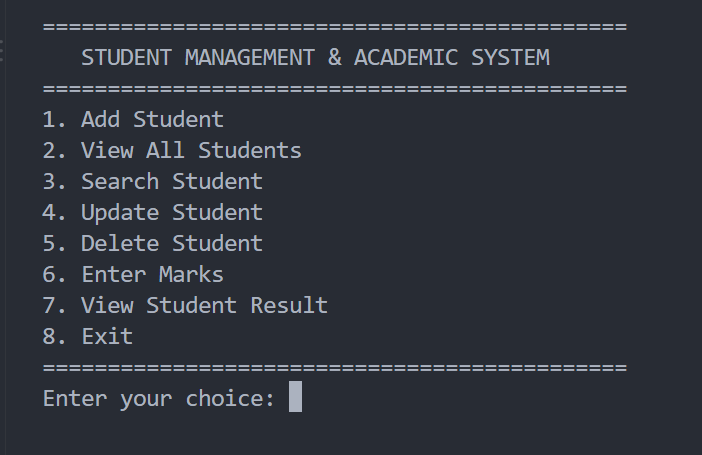
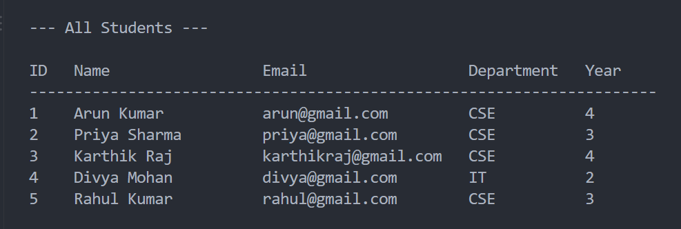
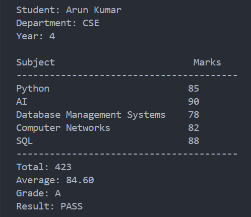

# 🎓 Student Management & Academic System

A command-line **Student Management & Academic System** built using **Python and MySQL**.

The application allows users to manage student records, enter marks, and view academic results through a simple menu-driven interface.

## ✨ Features

* **Add Student** — Add new student records
* **View All Students** — Display all registered students
* **Search Student** — Search for a student using their ID
* **Update Student** — Update student details
* **Delete Student** — Remove student records
* **Enter Marks** — Add subject marks for students
* **View Student Result** — Calculate total, average, grade, and result
* **Input Validation** — Handles invalid user input
* **Duplicate Prevention** — Prevents duplicate marks for the same subject

## 🛠️ Technologies Used

* Python
* MySQL
* SQL
* MySQL Connector/Python
* python-dotenv
* Command Line Interface (CLI)

## 📁 Project Structure

```text
student-management-system/
│
├── database/
│   └── schema.sql
│
├── src/
│   ├── database.py
│   ├── student.py
│   └── main.py
│
├── requirements.txt
├── .gitignore
└── README.md
```

## 🗄️ Database Design

The application uses a MySQL database named:

```text
student_management
```

### Tables

| Table      | Purpose                    |
| ---------- | -------------------------- |
| `students` | Stores student information |
| `subjects` | Stores subject information |
| `marks`    | Stores student marks       |

The complete database structure is available in:

```text
database/schema.sql
```

## ⚙️ Setup & Installation

### 1. Clone the Repository

```bash
git clone <your-repository-url>
cd student-management-system
```

### 2. Create a Virtual Environment

```bash
python -m venv venv
```

Activate it on Windows:

```powershell
venv\Scripts\activate
```

### 3. Install Dependencies

```bash
pip install -r requirements.txt
```

### 4. Set Up MySQL

Open MySQL Workbench or MySQL Command Line and run the SQL commands from:

```text
database/schema.sql
```

This creates the database, tables, and subjects.

### 5. Configure Environment Variables

Create a `.env` file in the project root:

```text
MYSQL_PASSWORD=your_mysql_password
```

**Never upload your `.env` file to GitHub.**

The `.env` file is included in `.gitignore`.

### 6. Run the Application

From the project root:

```bash
python src/main.py
```

## 🖥️ Application Menu

```text
=============================================
   STUDENT MANAGEMENT & ACADEMIC SYSTEM
=============================================
1. Add Student
2. View All Students
3. Search Student
4. Update Student
5. Delete Student
6. Enter Marks
7. View Student Result
8. Exit
=============================================
```
## 📸 Screenshots

### Main Menu



### View All Students



### Student Result



## 📊 Sample Result

```text
--- Student Result ---

Student: Arun Kumar
Department: CSE
Year: 4

Subject                         Marks
----------------------------------------
Python                         85
AI                             90
Database Management Systems    78
Computer Networks              82
SQL                            88
----------------------------------------
Total: 423
Average: 84.60
Grade: A
Result: PASS
```

## 🧠 Concepts Demonstrated

This project demonstrates practical understanding of:

* Python functions
* Conditional statements
* Exception handling
* CRUD operations
* SQL queries
* Primary keys
* Foreign keys
* SQL `JOIN`
* Parameterized SQL queries
* Python-MySQL connectivity
* Database transactions
* Environment variables
* Input validation

## 🎯 What I Learned

Through this project, I gained hands-on experience in building a database-driven application using Python and MySQL.

I practiced designing database tables, connecting Python applications to MySQL, implementing CRUD operations, validating user input, and generating academic results using SQL and Python logic.

## 🚀 Future Improvements

* Convert the CLI application into a web application
* Build REST APIs using FastAPI
* Add a modern web interface
* Build a React frontend

## 👩‍💻 Author

**Suba Lakshmi K**

